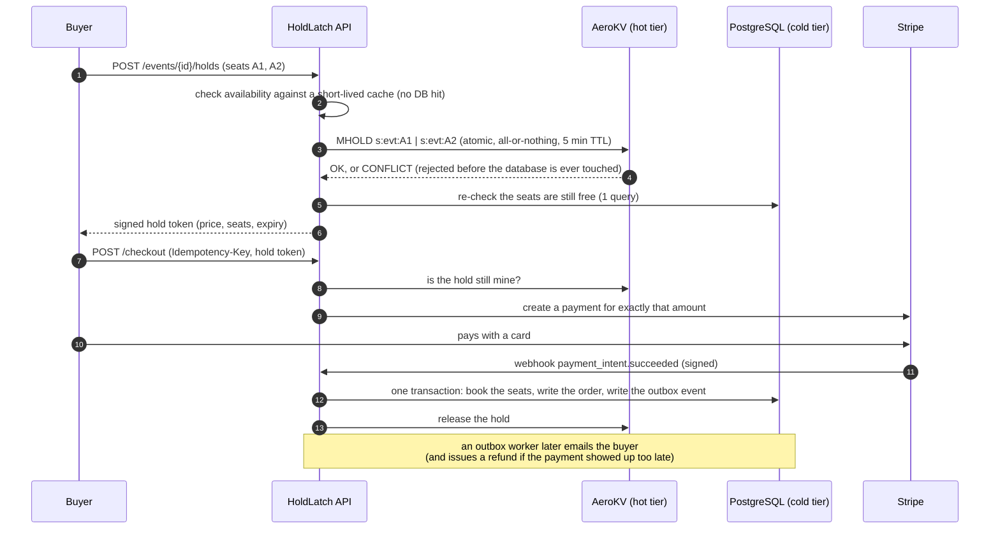

# HoldLatch

[](https://github.com/meetcodesjava/holdlatch/actions/workflows/ci.yml)
[](https://openjdk.org/projects/jdk/21/)
[](https://spring.io/projects/spring-boot)
[](LICENSE)

Backend for selling tickets during a flash sale, where hundreds of people can be trying to grab the same seat at
the same instant. The interesting problem here isn't the CRUD around events and seats, it's making sure exactly
one buyer wins a contested seat and nobody's card gets charged for a seat they didn't actually get.

Seat holds are handled by a small in-memory store I wrote myself, called [AeroKV](https://github.com/meetcodesjava/aerokv-holdlatch),
instead of reaching for Redis. It sits in front of Postgres: a buyer who loses a race for a seat never touches
the database at all, so the DB only ever sees requests that are actually going somewhere.

## Why this exists

I wanted something on my resume that isn't another CRUD app with auth bolted on. Flash sales (Ticketmaster-style
drops, PS5 restocks, whatever) are a genuinely hard concurrency problem: you have one seat and a thousand people
who want it, and the wrong answer costs someone real money. Building this forced me to actually deal with race
conditions, idempotency, and the fact that payments and databases don't fail atomically together.

## How a purchase actually happens



## The interesting problems, and how I dealt with them

I'm not going to pretend every one of these was obvious up front. A few of them (marked below) I only found because
the load test broke.

| Problem | What I did about it |
|---|---|
| Same seat, same millisecond, two buyers | Atomic `HOLD`/`MHOLD` in AeroKV, locked by seat under striped locks. One winner, everyone else gets a `409`. There's also a unique constraint and a conditional `UPDATE` in Postgres as a last line of defence, in case the in-memory layer is ever wrong. |
| Buyer A wants seats [1,2], buyer B wants [2,1] at the same time | Classic lock-ordering deadlock. AeroKV always locks stripes in a fixed order regardless of the order they were requested in. |
| **(found by load testing)** Database ran out of connections under load | Every hold request, even a losing one, was running a couple of SQL queries first. At 300 concurrent buyers that exhausted a 20-connection pool and started throwing 500s. Fixed by validating against an in-process cache, so a losing hold now costs zero SQL statements. |
| **(found by load testing, later, against the actual Docker stack)** AeroKV's own connection pool ran out | Same shape of bug as above but one layer down — 64 pooled connections to AeroKV wasn't enough once the DB stopped being the bottleneck. Bumped the pool size, re-ran the test, errors gone. |
| Abandoned holds nobody released | 5-minute TTL inside AeroKV. A background sweep also cancels the matching Stripe payment intent so it can't be paid late. |
| Payment clears right as the hold timer expires | There's a short grace period — same seats back if nobody else took them, otherwise the payment gets refunded automatically. |
| Stripe retries the same webhook a dozen times | Payment state machine plus a row lock. Twelve identical webhooks in, one order out. |
| User double-clicks checkout | `Idempotency-Key` header, same key replays the original response instead of charging twice. |
| Process crashes between "order saved" and "confirmation sent" | Transactional outbox — the order and the outbound event commit in the same DB transaction, a worker delivers it later with retries. |
| AeroKV itself restarts | It has a write-ahead log, so active holds come back with their real remaining TTL instead of just vanishing. |
| Scalpers / bots hammering the login endpoint | Per-IP token bucket, much stricter on `/auth/login` than the rest of the API. |
| Forged hold tokens | HMAC-SHA256 signed, checked in constant time. |

## Running it

```bash
cp .env.example .env    # then fill in real secrets, see comments in the file
docker compose up --build
```

That starts Postgres, AeroKV, and HoldLatch. API is on `http://localhost:8081`, health check at `/actuator/health`.
Stripe and email are both optional — without keys, payment endpoints answer `503` and confirmation emails just get
logged instead of sent. Everything else works fine without them.

Running without Docker needs JDK 21 and a local Postgres. AeroKV runs separately (it's its own repo):

```bash
# AeroKV, from the aerokv-holdlatch repo
mvn compile && java -cp target/classes day06.AeroKVServerApp

# HoldLatch - put two random 32+ char secrets in src/main/resources/application-local.yml (git-ignored):
#   holdlatch: { security: { jwt-secret: "..." }, hold: { token-secret: "..." } }
./mvnw spring-boot:run -Dspring-boot.run.profiles=local
```

## API

Everything except register/login/the Stripe webhook needs `Authorization: Bearer <token>`. Errors come back as
RFC 7807 problem documents with a stable `code` field, not just a status and a message.

| Endpoint | Who | What it does |
|---|---|---|
| `POST /api/auth/register`, `POST /api/auth/login`, `GET /api/auth/me` | anyone / logged in | account creation and JWT login |
| `POST /api/events`, `POST /api/events/{id}/publish` | organizer | create an event and put it on sale |
| `GET /api/events`, `GET /api/events/{id}`, `.../sections/{sid}/seats` | anyone logged in | browse events and seat availability |
| `POST /api/events/{id}/holds` | logged in | hold seats/standing tickets, all-or-nothing, returns a signed token |
| `POST /api/holds/release` | the holder | give a hold back early |
| `POST /api/checkout` (`Idempotency-Key` header) | the holder | start paying for a hold |
| `GET /api/checkout/{id}`, `GET /api/orders`, `GET /api/orders/{id}` | the buyer | check payment/order status |
| `POST /api/webhooks/stripe` | Stripe | signature-verified payment notifications |

## Configuration

All settings come from environment variables (defaults are in `application.yml`).

| Variable | What it's for | Default |
|---|---|---|
| `JWT_SECRET`, `HOLD_TOKEN_SECRET` | signing keys, required, 32+ bytes or the app refuses to start | — |
| `DB_URL`, `DB_USER`, `DB_PASSWORD`, `DB_POOL_SIZE` | Postgres connection | localhost / holdlatch / 20 |
| `AEROKV_HOST`, `AEROKV_PORT`, `AEROKV_PASSWORD` | where AeroKV lives | localhost / 8080 / none |
| `HOLD_TTL`, `HOLD_PAYMENT_GRACE`, `HOLD_MAX_TICKETS` | how long a hold lasts, grace window, tickets per hold | 5 min / 2 min / 8 |
| `CATALOG_CACHE_TTL` | how stale the hold-path cache is allowed to be | 1 s |
| `STRIPE_SECRET_KEY`, `STRIPE_WEBHOOK_SECRET` | turns payments on | off (`503` without them) |
| `SMTP_HOST`, `SMTP_USERNAME`, `SMTP_PASSWORD`, `MAIL_FROM` | turns order-confirmation emails on | off (logged only) |

## Testing

```bash
mvn verify        # 112 tests, roughly a minute and a half
```

Tests run against a real Postgres (downloaded and started automatically, nothing to install), a real AeroKV
server over its actual wire protocol, and a real embedded SMTP server for the email path — not mocks for any
of them, on purpose, because mocks don't catch constraint violations or lock behaviour. Things I specifically
went out of my way to test: concurrent hold races, idempotent checkout under concurrency, duplicate/concurrent
webhooks, late payments landing in and out of the grace window, an AeroKV outage returning a clean `503`, real
Stripe-signature verification (not a fake signature), and a test that literally counts JDBC statements to prove
a losing hold runs zero of them.

## Load test

`loadtest/flash_sale.py` (stdlib only, no dependencies) throws a crowd of buyers at a hall of 100 seats and
checks nothing broke.

| Buyers | Throughput | p50 | p99 | Errors | Double-bookings |
|---:|---:|---:|---:|---:|---:|
| 100 | ~1,500 req/s | 32 ms | 122 ms | 0 | 0 |
| 300 | ~600 req/s | 379 ms | 1,083 ms | 0 | 0 |

Those numbers are from one laptop with the load generator, HoldLatch, AeroKV and Postgres all fighting for the
same CPU, so real hardware does better. Two things actually broke during testing, both fixed, both in the table
above: DB pool exhaustion on the first run, and AeroKV's own connection pool being too small once that was fixed.
Full writeup in [`loadtest/README.md`](loadtest/README.md).

## What I'd do differently / known limitations

Being upfront about the rough edges instead of pretending they don't exist:

- **AeroKV is a single node.** It has a write-ahead log so a restart doesn't lose holds, but there's no
  replication or failover — if it's down, the API returns `503` rather than guessing. A real multi-node setup
  needs leader election, which felt like a separate project.
- **Standing-room capacity is approximate under heavy contention** — the database counter is still the source
  of truth and will never oversell, but a request can occasionally get refused when a slot technically exists.
- **Rate limiting is per-instance**, not shared across a fleet. Fine for one box, wouldn't be for several.
- **JWTs are access-token-only**, one hour, no refresh tokens or a logout blacklist.
- **Stripe and SMTP paths are both real**, tested against live test-mode accounts, not just unit tests against a
  fake — but I haven't run either against production traffic, obviously.
- **Didn't build:** a waiting-room queue in front of the sale, or a CAPTCHA/bot-challenge layer. Both are real
  things a production system like this would want; I scoped them out to keep this finishable.

## Project layout

```
controller/      HTTP endpoints (thin)              service/    business logic: allocation, holds, checkout, settlement
engine/aerokv/   pooled TCP client for AeroKV        payment/    payment-provider interface + Stripe implementation
email/           email-provider interface + SMTP     outbox/     outbox event handlers (email, refunds)
model/           domain enums, hold token, entities  security/   JWT, rate limiting, request ids
repository/      Spring Data repositories            db/migration/  Flyway schema
loadtest/        the flash-sale load test script
```

AeroKV is a separate repo: <https://github.com/meetcodesjava/aerokv-holdlatch> — a fork of my original AeroKV
project, with atomic multi-key holds, compare-and-delete release, hold pinning against eviction, and WAL replay
of remaining TTL added on top for this use case.

## License

MIT, see [LICENSE](LICENSE).
