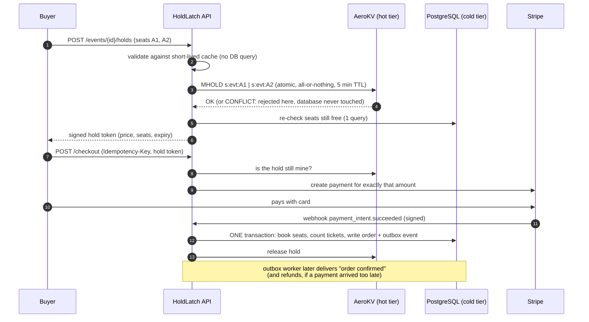

# HoldLatch

A seat-reservation backend built for **flash sales**: tens of thousands of buyers fighting over the same seats
at the same moment, without double-booking and without melting the database.

Seats are claimed in a purpose-built in-memory engine, **[AeroKV](https://github.com/meetcodesjava/aerokv-holdlatch)**
(my own key-value store, with striped locks, TTL expiry and a write-ahead log), that sits in front of PostgreSQL. A buyer who
loses the race is turned away in memory; the database only ever sees purchases that are really going to happen.

> Java 21 · Spring Boot 3.5 · PostgreSQL 17 · Flyway · Stripe · Docker · 108 automated tests

## How a purchase flows



## What it solves

Every problem below is handled in code **and covered by a test**.

| Problem | How it is handled |
|---|---|
| **Double-booking** when many buyers request the same seat at the same millisecond | Atomic `HOLD`/`MHOLD` in AeroKV under striped locks: exactly one winner, everyone else gets a clean `409`. Backed by a unique constraint and a conditional `UPDATE` in the database as the last line of defence. Tested with 40 threads (unit) and 300 buyers (load test): always exactly one winner. |
| **Multi-seat deadlocks** (A wants seats 1,2 while B wants 2,1) | AeroKV locks all needed stripes in a fixed order; the client also sorts keys. Tested with opposing orders. |
| **Database connection starvation** | Hold-path validation runs on a short-lived in-memory cache, so a hold that loses the race runs **zero** SQL statements and a winning one runs **one**. A test counts real JDBC statements. Found and fixed by load testing (see below). |
| **Thundering herd** on a popular seat map | Cache loads are coalesced: 100 simultaneous misses cause exactly one database load. |
| **Ghost holds** (abandoned checkouts) | 5-minute TTL enforced inside AeroKV (lazy expiry on read). A sweep also cancels unpaid payments at Stripe so they can never be paid late. |
| **Late payment** (bank clears just as the timer expires) | Grace period: the buyer wins the *same* seats back if nobody else took them; otherwise a compensating **refund** is issued. Never a double-booking. |
| **Duplicate payment webhooks** | The payment's state machine plus a row lock: the same webhook delivered 12 times at once creates exactly one order. |
| **Retried checkout** (double-click, flaky network) | `Idempotency-Key`: the same key replays the original answer; nothing is charged twice. |
| **Memory/database dual-write inconsistency** | **Transactional outbox**: the order and its outgoing event commit in one transaction; a worker delivers them at-least-once with exponential backoff (`SKIP LOCKED`, so several workers are safe). |
| **Holds lost on a crash** | AeroKV's write-ahead log restores active holds with their *remaining* TTL and keeps them pinned against eviction. |
| **Hold released by the wrong person** | AeroKV has a compare-and-delete (`RELEASEIF`): a late release can never free a seat someone else now holds. |
| **Scalper bots / brute force** | Token-bucket rate limiting per client address, much stricter on login. |
| **Seat fragmentation** | Selections that would strand a single unsellable seat are rejected (configurable). |
| **Hybrid venues** | Per event: numbered seats, standing room, or both. Standing room is modelled as AeroKV slots with a database counter as the final guard. |
| **Tampered or forged holds** | Hold tokens are HMAC-SHA256 signed and verified in constant time. |

## Tech stack

Java 21 (virtual threads) · Spring Boot 3.5 (Web, Security, Data JPA, Validation, Actuator) · PostgreSQL 17 + Flyway migrations ·
Hibernate · Caffeine · Apache Commons Pool2 · Stripe Java SDK · JWT (HS256) · Maven · Docker / Docker Compose · GitHub Actions ·
JUnit 5, Mockito, MockMvc, embedded real PostgreSQL for tests · Python (asyncio) load test.

## Quick start (Docker)

```bash
cp .env.example .env        # then edit the secrets (32+ characters each)
docker compose up --build   # starts PostgreSQL, AeroKV and HoldLatch
```

The API is on `http://localhost:8081`; `GET /actuator/health` reports the database and AeroKV. Payments need Stripe test keys in
`.env`; without them everything else works and payment endpoints answer `503 PAYMENTS_NOT_CONFIGURED`.

## Run locally (without Docker)

You need JDK 21 and a PostgreSQL database `holdlatch` (user/password `holdlatch` by default).

```bash
# 1. AeroKV (from the aerokv-holdlatch repository)
mvn compile && java -cp target/classes day06.AeroKVServerApp

# 2. HoldLatch - create src/main/resources/application-local.yml (git-ignored) holding two random 32+ char secrets:
#      holdlatch: { security: { jwt-secret: "..." }, hold: { token-secret: "..." } }
./mvnw spring-boot:run -Dspring-boot.run.profiles=local
```

## API

Everything except register, login and the Stripe webhook needs `Authorization: Bearer <token>`. Errors are RFC 7807 problem documents with a stable `code`.

| Method & path | Who | Purpose |
|---|---|---|
| `POST /api/auth/register` · `POST /api/auth/login` · `GET /api/auth/me` | anyone / user | Accounts (`CUSTOMER` or `ORGANIZER`) and JWT login |
| `POST /api/events` · `POST /api/events/{id}/publish` | organizer | Create an event (seated, standing or hybrid) and put it on sale |
| `GET /api/events` · `GET /api/events/{id}` · `GET /api/events/{id}/sections/{sid}/seats` | user | Browse events, availability and the seat map |
| `POST /api/events/{id}/holds` | user | Hold seats and/or standing tickets, all-or-nothing; returns a signed token |
| `POST /api/holds/release` | owner | Give a hold back |
| `POST /api/checkout` (`Idempotency-Key` header) | owner | Start payment for a hold |
| `GET /api/checkout/{paymentId}` · `GET /api/orders` · `GET /api/orders/{id}` | owner | Payment status and orders |
| `POST /api/webhooks/stripe` | Stripe | Signature-verified payment notifications |

## Configuration

All settings are environment variables (see `application.yml`). The important ones:

| Variable | Meaning | Default |
|---|---|---|
| `JWT_SECRET`, `HOLD_TOKEN_SECRET` | Signing keys, **required**, 32+ bytes (the app refuses to start otherwise) | - |
| `DB_URL`, `DB_USER`, `DB_PASSWORD`, `DB_POOL_SIZE` | PostgreSQL | localhost / holdlatch / 20 |
| `AEROKV_HOST`, `AEROKV_PORT`, `AEROKV_PASSWORD` | Hold engine | localhost / 8080 / none |
| `HOLD_TTL`, `HOLD_PAYMENT_GRACE`, `HOLD_MAX_TICKETS` | Hold length, late-payment grace, tickets per hold | 5 min / 2 min / 8 |
| `HOLD_REJECT_ORPHAN_SEATS` | Refuse selections that strand a lone seat | true |
| `CATALOG_CACHE_TTL` | Max staleness of hold-path reads | 1 s |
| `RATE_API_*`, `RATE_AUTH_*` | Token-bucket limits | see `application.yml` |
| `STRIPE_SECRET_KEY`, `STRIPE_WEBHOOK_SECRET` | Enable payments (test mode keys) | off |

## Testing

```bash
mvn verify        # 108 tests, ~1.5 minutes
```

The tests use a **real PostgreSQL** (downloaded and started by the test run - nothing to install) and a real AeroKV wire-protocol server,
not mocks, so they catch what mocks hide: constraint violations, lock behaviour, transaction boundaries. Highlights: concurrent
hold races, idempotent-checkout races, duplicate/concurrent webhooks, late payments in and out of the grace period, refund retry with
backoff, an AeroKV outage (clean `503`), real Stripe-format webhook signatures, and the zero-SQL-statement proof for lost races.

## Load test

`loadtest/flash_sale.py` (standard library only) simulates a drop and checks the invariants. On one laptop, sharing CPU with everything else:

| Buyers | Throughput | p50 | p99 | 5xx | Double-bookings |
|---:|---:|---:|---:|---:|---:|
| 100 | ~1,500 req/s | 32 ms | 122 ms | 0 | 0 |
| 300 | ~600 req/s | 379 ms | 1,083 ms | 0 | 0 |

The first run of this test *failed* (8 server errors from connection-pool exhaustion), which led to the cache design above.
Full story and how to run it: [`loadtest/README.md`](loadtest/README.md).

## Design decisions and honest limitations

- **AeroKV is a single node.** It has a write-ahead log, so holds survive a restart, but there is no replication or failover: if it is down, holds are unavailable (the API answers `503`, it never guesses). Multi-node would need leader election, which is out of scope.
- **Clocks.** AeroKV is the only authority on whether a hold is alive. Application nodes' clocks only matter for the soft token expiry and the grace window. AeroKV stores absolute expiry times so holds survive restarts, so it depends on its own host's wall clock.
- **Standing room** is approximate under extreme contention: when a section is almost full of live holds a request can occasionally be refused although a slot exists. The database counter guarantees it can never oversell; at worst a payment that cannot be fulfilled is refunded.
- **The orphan-seat rule** counts booked seats, not seats other people are currently holding (that would cost one AeroKV lookup per seat).
- **Rate limits are per instance**, not shared across a fleet.
- **Access tokens only** (1 hour); no refresh tokens or logout list.
- **"Order confirmed" notifications** are delivered reliably by the outbox but only logged; no email provider is wired in.
- **Stripe** code paths that call Stripe itself have not been exercised against a live account in this repository (signature verification and payload parsing are tested with genuine Stripe-format signatures; everything else runs against a test double).
- **Not implemented from the original design:** a virtual waiting-room queue and CAPTCHA/bot challenges.

## Project layout

```
controller/   HTTP endpoints (thin)                 service/      business logic: allocation, holds, checkout, settlement
engine/aerokv/ pooled TCP client for AeroKV         payment/      payment-provider interface + Stripe implementation
model/        domain enums, hold token, JPA entities outbox/       outbox event handlers
repository/   Spring Data repositories             security/     JWT, rate limiting, request ids
db/migration/ Flyway schema (V1-V3)                 loadtest/     flash-sale load test
```

AeroKV lives in its own repository: <https://github.com/meetcodesjava/aerokv-holdlatch>
(a fork of my original AeroKV, adding atomic holds, compare-and-delete release, hold pinning, WAL replay of remaining TTL, and virtual threads).
